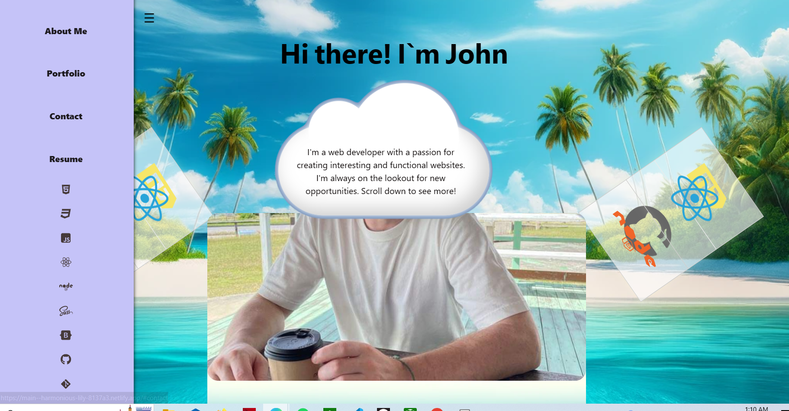

# 🚀 React Portfolio Prototype 🚀

Welcome to my React Portfolio Prototype! This is a work-in-progress 🛠️ and a stepping stone towards a more sleek and professional portfolio and a window into my journey as a web developer. Thanks for lookin! 🌟

## Deployed Application 🌐

Check out the live version here: [Deployed Application](https://johns-portfolio-prototype.netlify.app/)

## Project Overview 📖

As a budding full stack web developer, I'm creating a portfolio using React to showcase my projects from bootcamp in a modern and dynamic way. This portfolio is not just a collection of work samples but a testament to my journey, skills, and the potential for future growth. 🌱

### User Story 👤

- **AS AN** employer looking for candidates with experience building single-page applications
- **I WANT** to view a potential employee's deployed React portfolio of work samples
- **SO THAT** I can assess whether they're a good candidate for an open position

### Acceptance Criteria ✅

- Portfolio presents a header, content section, and footer.
- Navigation titles: About Me, Portfolio, Contact, and Resume.
- Corresponding section renders below navigation without reloading.
- About Me section selected by default.
- Portfolio section showcases six projects with images, titles, and links.
- Contact section includes a form with name, email, and message fields.
- Resume section contains a downloadable resume and a list of proficiencies.
- Footer links to GitHub, LinkedIn, and a third platform.

## Getting Started 🚀

This project was bootstrapped with [Create React App](https://github.com/facebook/create-react-app). To get started:

1. Clone the repo
2. Install dependencies with `npm install`
3. Start the server with `npm start`
4. Enjoy!

## Features 🌟

- **React Single Page Application**: Ensuring a seamless user experience (unless you are on mobile, sorry!).
- **Dynamic Navigation**: Smooth scrolling and parallax images with react router dom.
- **Portfolio Showcase**: Highlights my projects with live links!
- **Contact Form**: Reach out!

## Future Development 🔮

This is only a rough draft, in the near future I will:

- Implement a sleek, professional design.
- Expand the project section with more & more flushed out projects!
- Incorporate animations and perhaps some interactive elements.

## Feedback and Collaboration 🤝

 Feel free to reach out through the contact form or connect with me on [GitHub](JohnM89),

## Getting Close to the End but its only the Beginning! 🙏

A big thank you to everyone who has supported me on this journey!

## Screenshot 🚀

Here's a screenshot for you 👀:

---

Made by `yours truley`
